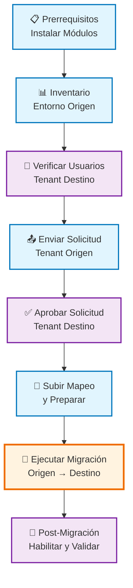

# Kit de Herramientas para Migración Tenant-a-Tenant de Power Platform

> **🌐 Idioma:** [English](README.md) | **Español**

Kit profesional para migrar entornos de Power Platform / Dynamics 365 entre tenants de Microsoft usando cmdlets oficiales de PowerShell.

## 🚀 Inicio Rápido

1. **Configura tu migración**
   ```powershell
   # Edita Config.ps1 con los detalles de tu tenant y entorno
   notepad Config.ps1
   ```

2. **Ejecuta migración completa**
   ```powershell
   # Modo interactivo con confirmaciones
   .\MigrationRunbook.ps1
   
   # Modo desatendido
   .\MigrationRunbook.ps1 -Mode Unattended
   ```

3. **O ejecuta fases individuales**
   ```powershell
   .\MigrationRunbook.ps1 -Phase Prerequisites
   .\MigrationRunbook.ps1 -Phase Inventory
   # ... etc
   ```

## 📋 Prerrequisitos

- **PowerShell 5.1+** (Windows PowerShell recomendado)
- **VS Code** con extensión de PowerShell (recomendado)
- **Permisos de administrador de tenant** en ambos tenants origen y destino
- Roles de **administrador de Power Platform** o **administrador de Dynamics 365**
- **Permisos de Microsoft Graph** (para validación de usuarios)

### Tipos de Entorno Soportados
- ✅ Entornos de **Producción**
- ✅ Entornos **Sandbox**
- ❌ Entornos Default, Developer, Trial, Teams (no soportados por Microsoft)

## 🔄 Proceso de Migración

### Diagrama de Flujo de Migración



### Resumen de Contexto por Tenant

```
┌─────────────────────────────────────────────────────────────────────────────────┐
│                         FLUJO DE TRABAJO DE MIGRACIÓN                          │
├─────────────────────────────┬───────────────────────────┬───────────────────────┤
│        TENANT ORIGEN        │      COORDINACIÓN        │      TENANT DESTINO   │
├─────────────────────────────┼───────────────────────────┼───────────────────────┤
│                             │                           │                       │
│  1️⃣ Configurar Prerrequisitos│                           │                       │
│  2️⃣ Inventariar Entorno     │                           │                       │
│  3️⃣ Enviar Migración ────────┼─────────────────────────┼──► Debe aprobarse      │
│                             │                           │  4️⃣ Verificar Usuarios │
│                             │                           │  5️⃣ Aprobar Solicitud  │
│                             │   📋 ID de Migración      │                       │
│  6️⃣ Subir Mapeo Usuarios ◄───┼─────────────────────────┼──── Generado          │
│  7️⃣ Preparar Migración      │                           │                       │
│  8️⃣ Ejecutar Migración ──────┼──► 🚀 MIGRACIÓN VIVA ───┼──► Entorno migrado     │
│                             │                           │  9️⃣ Tareas Post-       │
│                             │                           │     Migración y Valid. │
│                             │                           │                       │
└─────────────────────────────┴───────────────────────────┴───────────────────────┘
```

### Resumen de Fases
1. **Prerrequisitos** - Instalar módulos de PowerShell requeridos
2. **Inventario** - Catalogar entorno origen (flujos, apps, conectores)
3. **Verificar Usuarios** - Validar usuarios y licencias del tenant destino
4. **Enviar** - Enviar solicitud de migración desde tenant origen
5. **Aprobar** - Aprobar solicitud de migración en tenant destino
6. **Preparar** - Subir mapeo de usuarios y preparar migración
7. **Migrar** - Ejecutar la migración real
8. **Post-Migración** - Habilitar flujos y validar migración

## ⚙️ Configuración

Edita `Config.ps1` antes de ejecutar:

```powershell
# === CONFIGURACIÓN DE TENANT ===
$Global:TargetTenantId = "tu-tenant-destino-id"
$Global:EnvironmentDisplayName = "Nombre de Tu Entorno"

# === RUTAS DE ARCHIVO ===
$Global:UserMappingCsvPath = ".\usermapping.csv"

# === CONFIGURACIÓN DE MIGRACIÓN ===
$Global:MigrationId = ""  # Se establece automáticamente después de la aprobación
$Global:SecurityGroupId = ""  # Opcional
```

### Formato CSV de Mapeo de Usuarios
Crea `usermapping.csv` con mapeos de usuarios origen y destino:
```csv
SourceUpn,TargetUpn
usuario1@tenantorigen.com,usuario1@tenantdestino.com
usuario2@tenantorigen.com,usuario2@tenantdestino.com
```

## 🛠️ Uso Avanzado

### Reanudar desde Checkpoint
```powershell
# Reanudar desde fase específica
.\MigrationRunbook.ps1 -ResumeFromCheckpoint

# O especificar fase manualmente
.\MigrationRunbook.ps1 -Phase Migrate
```

### Modo de Prueba
```powershell
# Probar el runbook sin ejecutar
.\MigrationRunbook.ps1 -DryRun
```

## ⚠️ Limitaciones Importantes

- **Ventana de 7 días**: La migración debe completarse dentro de 7 días de la preparación
- **Tipos de Entorno**: Solo Production y Sandbox soportados
- **Apps de Canvas**: Deben exportarse manualmente antes de la migración
- **Conectores Personalizados**: Requieren exportación/importación manual
- **Conexiones**: Deben reautenticarse en el tenant destino
- **Nube Gubernamental**: No soportada

## 🔧 Solución de Problemas

### Problemas Comunes

**Fallos de Autenticación**
```powershell
# Limpiar credenciales en caché
Clear-Variable -Name * -Scope Global -ErrorAction SilentlyContinue
# Reiniciar PowerShell e intentar de nuevo
```

**Entorno No Encontrado**
- Verificar ortografía del nombre del entorno
- Asegurarse de estar conectado al tenant correcto
- Verificar tipo de entorno (solo Production/Sandbox soportado)

**Migración Bloqueada**
- Verificar conectividad de red
- Verificar capacidad del tenant
- Revisar migration-error-details.txt

## 📈 Mejores Prácticas

### Pre-Migración
- [ ] Respaldar entorno origen
- [ ] Asegurar que todos los flujos estén en soluciones
- [ ] Exportar apps de Canvas manualmente
- [ ] Preparar paquetes de conectores personalizados
- [ ] Validar completitud del mapeo de usuarios
- [ ] Probar con entorno no productivo primero

### Durante la Migración
- [ ] Monitorear logs continuamente
- [ ] No interrumpir el proceso de migración
- [ ] Mantener sesión de PowerShell activa
- [ ] Tener plan de rollback listo

### Post-Migración
- [ ] Reautenticar todas las referencias de conexión
- [ ] Probar procesos de negocio críticos
- [ ] Actualizar URLs de sistemas externos
- [ ] Validar permisos de seguridad
- [ ] Actualizar documentación

## 📄 Historial de Versiones

- **v1.0** - Lanzamiento inicial con scripts básicos de migración
- **v2.0** - Configuración centralizada agregada y orquestador runbook
- **v2.1** - Manejo de errores mejorado y logging comprensivo
- **v2.2** - Funcionalidad de checkpoint/resume agregada
- **v2.3** - Validación de usuarios mejorada y reportes post-migración

## 🔒 Notas de Seguridad

- Nunca confirmar credenciales al control de versiones
- Usar cuentas de servicio con permisos mínimos requeridos
- Rotar tokens de autenticación regularmente
- Monitorear logs de auditoría durante la migración
- Seguir el principio de menor privilegio

---

## 🆘 Soporte

### Obtener Ayuda
- **Documentación de Microsoft**: [Guía oficial de migración tenant-a-tenant](https://learn.microsoft.com/es-es/power-platform/admin/move-environment-tenant)
- **Ayuda de PowerShell**: Usar `Get-Help <nombre-cmdlet>` para sintaxis detallada
- **Análisis de Logs**: Revisar `migration-runbook.log` para logs de ejecución detallados

---

**🌐 Disponible en:** [English](README.md) | **Español**