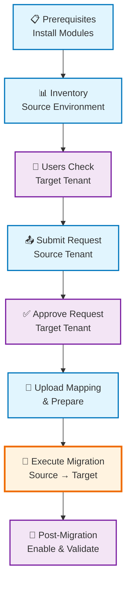

# Power Platform Tenant-to-Tenant Migration Toolkit

> **🌐 Language:** **English** | [Español](README.es.md)

Professional toolkit for migrating Power Platform / Dynamics 365 environments between Microsoft tenants using official PowerShell cmdlets.

## 🚀 Quick Start

1. **Configure your migration**
   ```powershell
   # Edit Config.ps1 with your tenant and environment details
   notepad Config.ps1
   ```

2. **Run complete migration**
   ```powershell
   # Interactive mode with confirmations
   .\MigrationRunbook.ps1
   
   # Unattended mode
   .\MigrationRunbook.ps1 -Mode Unattended
   ```

3. **Or run individual phases**
   ```powershell
   .\MigrationRunbook.ps1 -Phase Prerequisites
   .\MigrationRunbook.ps1 -Phase Inventory
   # ... etc
   ```

## 📋 Prerequisites

- **PowerShell 5.1+** (Windows PowerShell recommended)
- **VS Code** with PowerShell extension (recommended)
- **Tenant administrator permissions** in both source and target tenants
- **Power Platform administrator** or **Dynamics 365 administrator** roles
- **Microsoft Graph permissions** (for user validation)

### Supported Environment Types
- ✅ **Production** environments
- ✅ **Sandbox** environments
- ❌ Default, Developer, Trial, Teams environments (not supported by Microsoft)

## 🗂️ Project Structure

```
MigrationCRM/
├── Config.ps1                                    # Centralized configuration
├── MigrationRunbook.ps1                         # Master orchestrator
├── 00-Prereqs-Setup.ps1                        # Install required modules
├── 01-Inventory-And-Sanitation-Origin.ps1      # Inventory source environment
├── 02-Users-And-Licenses-Check-Destination.ps1 # Validate target users
├── 03-Submit-Migration-Origin.ps1              # Submit migration request
├── 04-Approve-Migration-Destination.ps1        # Approve in target tenant
├── 05-UploadMapping-Prepare-Origin.ps1         # Upload mapping & prepare
├── 06-Migrate-Origin.ps1                       # Execute migration
├── 07-PostMigration-Flow-Assist-Destination.ps1 # Post-migration tasks
└── migration-output/                           # Generated reports and logs
    ├── inventory/                              # Source environment inventory
    ├── users-check/                           # User validation results
    ├── post-migration/                        # Post-migration reports
    ├── migration-runbook.log                  # Comprehensive log file
    └── migration-checkpoint.json              # Resume capability
```

## ⚙️ Configuration

Edit `Config.ps1` before running:

```powershell
# === TENANT CONFIGURATION ===
$Global:TargetTenantId = "your-target-tenant-id"
$Global:EnvironmentDisplayName = "Your Environment Name"

# === FILE PATHS ===
$Global:UserMappingCsvPath = ".\usermapping.csv"

# === MIGRATION SETTINGS ===
$Global:MigrationId = ""  # Set automatically after approval
$Global:SecurityGroupId = ""  # Optional
```

### User Mapping CSV Format
Create `usermapping.csv` with source and target user mappings:
```csv
SourceUpn,TargetUpn
user1@sourcetenantcom,user1@targettenant.com
user2@sourcetenant.com,user2@targettenant.com
```

## 🔄 Migration Process

### Migration Flow Diagram



### Tenant Context Overview

```
┌─────────────────────────────────────────────────────────────────────────────────┐
│                           MIGRATION WORKFLOW                                    │
├─────────────────────────────┬───────────────────────────┬───────────────────────┤
│        SOURCE TENANT        │      COORDINATION       │      TARGET TENANT    │
├─────────────────────────────┼───────────────────────────┼───────────────────────┤
│                             │                           │                       │
│  1️⃣ Prerequisites Setup     │                           │                       │
│  2️⃣ Inventory Environment   │                           │                       │
│  3️⃣ Submit Migration ────────┼─────────────────────────┼──► Must be approved    │
│                             │                           │  4️⃣ Users Check        │
│                             │                           │  5️⃣ Approve Request    │
│                             │   📋 Migration ID         │                       │
│  6️⃣ Upload User Mapping ◄────┼─────────────────────────┼──── Generated         │
│  7️⃣ Prepare Migration       │                           │                       │
│  8️⃣ Execute Migration ────────┼──► 🚀 LIVE MIGRATION ──┼──► Environment moved   │
│                             │                           │  9️⃣ Post-Migration     │
│                             │                           │     Tasks & Validation │
│                             │                           │                       │
└─────────────────────────────┴───────────────────────────┴───────────────────────┘
```

### Phase Overview
1. **Prerequisites** - Install required PowerShell modules
2. **Inventory** - Catalog source environment (flows, apps, connectors)
3. **Users Check** - Validate target tenant users and licenses
4. **Submit** - Submit migration request from source tenant
5. **Approve** - Approve migration request in target tenant
6. **Prepare** - Upload user mapping and prepare migration
7. **Migrate** - Execute the actual migration
8. **Post-Migration** - Enable flows and validate migration

### Detailed Workflow

#### 1. Source Tenant Setup
```powershell
# Run in SOURCE tenant
.\MigrationRunbook.ps1 -Phase Prerequisites
.\MigrationRunbook.ps1 -Phase Inventory
.\MigrationRunbook.ps1 -Phase Submit
```

#### 2. Target Tenant Setup
```powershell
# Run in TARGET tenant  
.\MigrationRunbook.ps1 -Phase UsersCheck
.\MigrationRunbook.ps1 -Phase Approve
```

#### 3. Migration Execution
```powershell
# Run in SOURCE tenant
.\MigrationRunbook.ps1 -Phase Prepare
.\MigrationRunbook.ps1 -Phase Migrate
```

#### 4. Post-Migration
```powershell
# Run in TARGET tenant
.\MigrationRunbook.ps1 -Phase PostMigration
```

## 🛠️ Advanced Usage

### Resume from Checkpoint
```powershell
# Resume from specific phase
.\MigrationRunbook.ps1 -ResumeFromCheckpoint

# Or specify phase manually
.\MigrationRunbook.ps1 -Phase Migrate
```

### Dry Run Mode
```powershell
# Test the runbook without executing
.\MigrationRunbook.ps1 -DryRun
```

### Individual Script Execution
```powershell
# Run specific phase with custom parameters
.\01-Inventory-And-Sanitation-Origin.ps1 -EnvironmentDisplayName "Production"
.\02-Users-And-Licenses-Check-Destination.ps1 -UserMappingCsvPath ".\custom-mapping.csv"
```

## 📊 Generated Reports

The toolkit generates comprehensive reports:

- **Inventory Reports** (`inventory/`)
  - `flows.csv` - All flows with solution awareness
  - `apps.csv` - Canvas and model-driven apps
  - `custom-connectors.csv` - Custom connectors
  - `inventory-summary.txt` - Executive summary

- **User Validation** (`users-check/`)
  - `target-users-check.csv` - User existence and licenses
  - `user-validation-summary.txt` - Validation summary

- **Migration Tracking**
  - `migration-runbook.log` - Complete execution log
  - `migration-checkpoint.json` - Resume capability
  - `migration-success.txt` - Success details

- **Post-Migration** (`post-migration/`)
  - `flows-after-migration.csv` - Migrated flow status
  - `flow-enable-results.csv` - Bulk enable results
  - `post-migration-report.txt` - Comprehensive report

## ⚠️ Important Limitations

- **7-Day Window**: Migration must complete within 7 days of preparation
- **Environment Types**: Only Production and Sandbox supported
- **Canvas Apps**: Must be exported manually before migration
- **Custom Connectors**: Require manual export/import
- **Connections**: Must be re-authenticated in target tenant
- **Government Cloud**: Not supported

## 🔧 Troubleshooting

### Common Issues

**Authentication Failures**
```powershell
# Clear cached credentials
Clear-Variable -Name * -Scope Global -ErrorAction SilentlyContinue
# Restart PowerShell and try again
```

**Environment Not Found**
- Verify environment name spelling
- Ensure you're connected to correct tenant
- Check environment type (only Production/Sandbox supported)

**Migration Stuck**
- Check network connectivity
- Verify tenant capacity
- Review migration-error-details.txt

**Flows Not Enabling**
- Re-authenticate connection references first
- Check flow dependencies
- Verify connectors are available in target

### Log Analysis
```powershell
# View latest log entries
Get-Content .\migration-output\migration-runbook.log -Tail 50

# Search for errors
Select-String -Path .\migration-output\migration-runbook.log -Pattern "ERROR"
```

## 📈 Best Practices

### Pre-Migration
- [ ] Backup source environment
- [ ] Ensure all flows are solution-aware
- [ ] Export Canvas apps manually
- [ ] Prepare custom connector packages
- [ ] Validate user mapping completeness
- [ ] Test with non-production environment first

### During Migration
- [ ] Monitor logs continuously
- [ ] Don't interrupt the migration process
- [ ] Keep PowerShell session active
- [ ] Have rollback plan ready

### Post-Migration
- [ ] Re-authenticate all connection references
- [ ] Test critical business processes
- [ ] Update external system URLs
- [ ] Validate security permissions
- [ ] Update documentation

## 🆘 Support

## 📚 Complete Documentation

### 📖 Core Documentation
- **[README](README.md)** - Main project documentation *(you are here)*
- **[README.es](README.es.md)** - Documentación en español

### 🔧 Technical Reference  
- **[API Reference](docs/en/api-reference.md)** - Complete PowerShell cmdlets reference
- **[Troubleshooting](docs/en/troubleshooting.md)** - Common issues and solutions
- **[Best Practices](docs/en/best-practices.md)** - Enterprise migration guidelines

### 🌐 En Español
- **[Referencia API](docs/es/referencia-api.md)** - Referencia completa de cmdlets
- **[Solución de Problemas](docs/es/solucion-problemas.md)** - Problemas comunes y soluciones  
- **[Mejores Prácticas](docs/es/mejores-practicas.md)** - Guías de migración empresarial

### Getting Help
- **Microsoft Documentation**: [Official tenant-to-tenant migration guide](https://learn.microsoft.com/en-us/power-platform/admin/move-environment-tenant)
- **PowerShell Help**: Use `Get-Help <cmdlet-name>` for detailed syntax
- **Log Analysis**: Check `migration-runbook.log` for detailed execution logs
- **Technical Deep Dive**: See [API Reference](docs/en/api-reference.md) for complete cmdlet documentation
- **Issue Resolution**: Check [Troubleshooting Guide](docs/en/troubleshooting.md) for solutions

### Error Recovery
- Use checkpoint resume functionality
- Review generated error reports
- Check Microsoft service health
- Verify permissions and quotas

## 📝 Version History

- **v1.0** - Initial release with basic migration scripts
- **v2.0** - Added centralized configuration and runbook orchestrator
- **v2.1** - Enhanced error handling and comprehensive logging
- **v2.2** - Added checkpoint/resume functionality
- **v2.3** - Improved user validation and post-migration reporting

---

## 🔒 Security Notes

- Never commit credentials to version control
- Use service accounts with minimal required permissions  
- Regularly rotate authentication tokens
- Monitor audit logs during migration
- Follow principle of least privilege

## 📄 License

This toolkit is provided as-is for educational and professional use. Ensure compliance with Microsoft licensing terms and your organization's policies.

---

**🌐 Available in:** **English** | [Español](README.es.md)